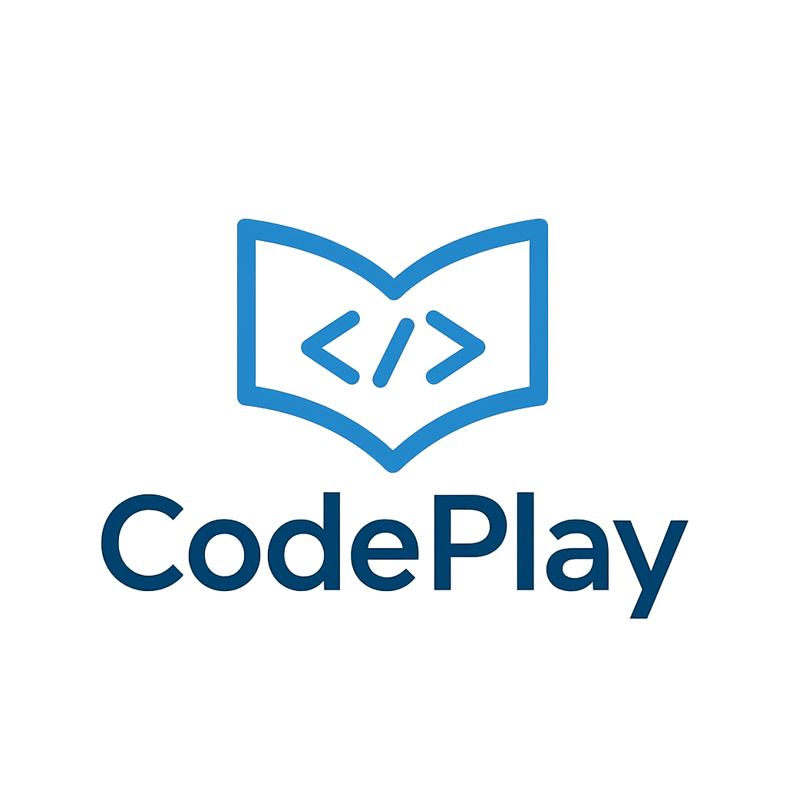

  

# 

CodePlay é um projeto acadêmico desenvolvido para auxiliar alunos e instituições de ensino no aprendizado de programação de forma gameficada.

## Sobre

- Projeto 100% acadêmico, aberto para estudo e consulta.
- O objetivo é tornar o aprendizado **mais envolvente e eficiente**, usando elementos de jogos (gameficado) para engajar os usuários.
- Conteúdos organizados por trilhas de aprendizagem
- Uso comercial requer autorização.

## Estrutura do Projeto

- **frontend/** → interface do usuário 
- **backend/** → API e lógica do servidor
- **database/** → scripts e esquemas do banco de dados
- **docs/** → documentação do projeto
- **assets/** → imagens, ícones e logos do projeto  
